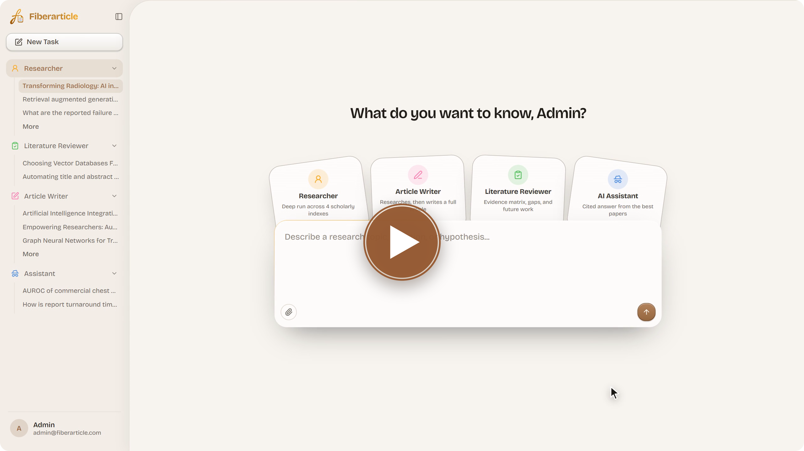
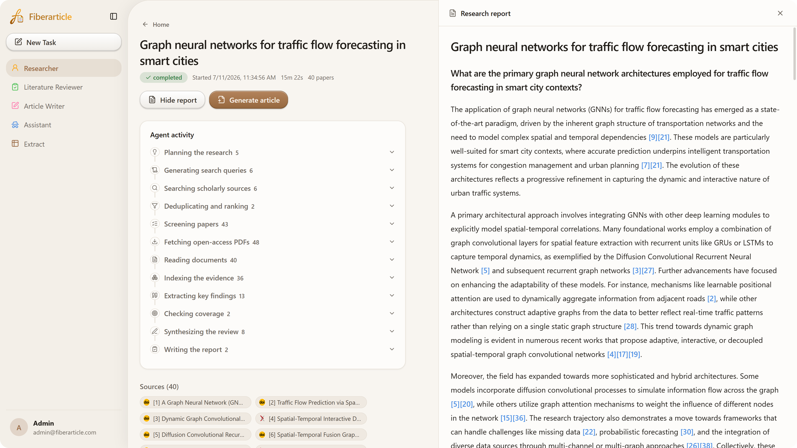
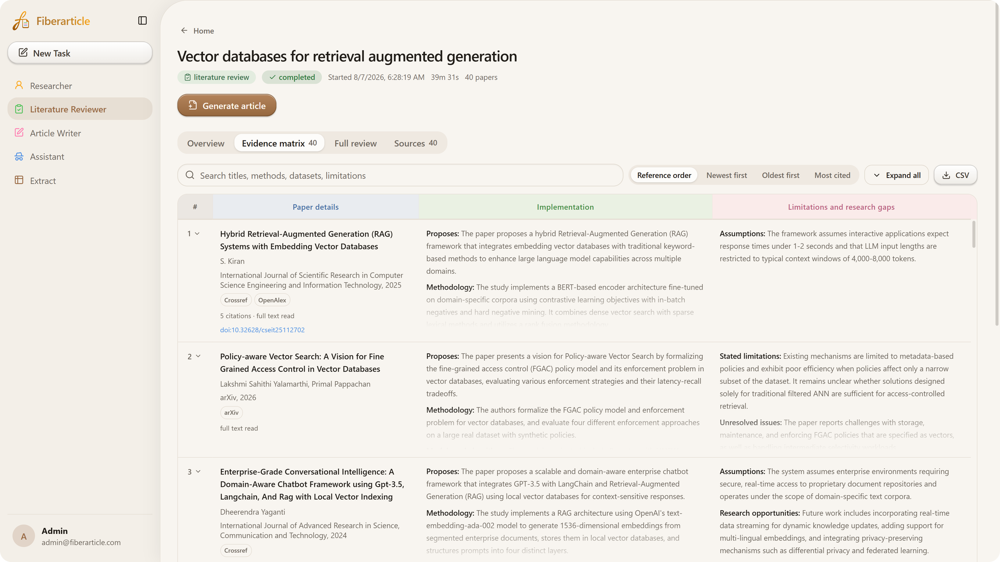
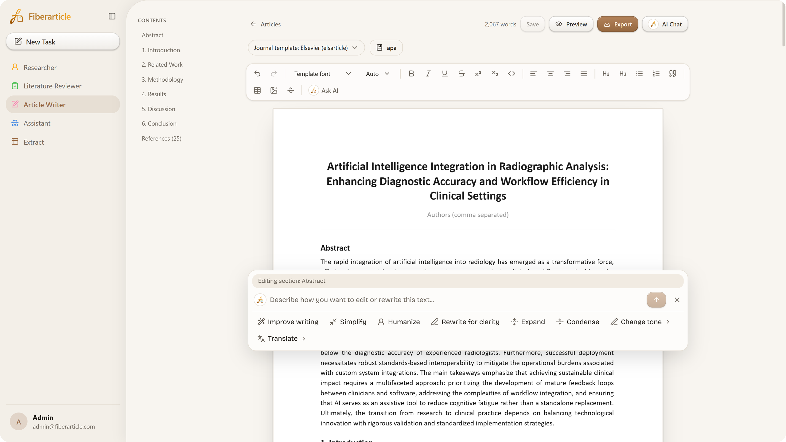
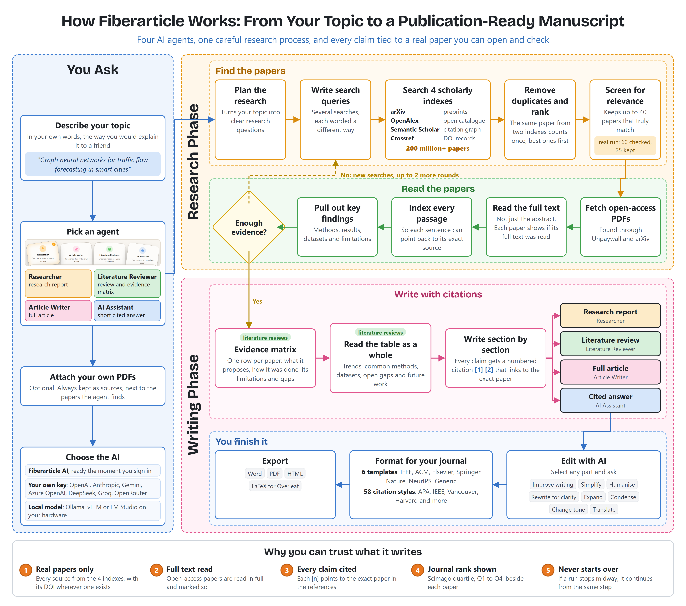
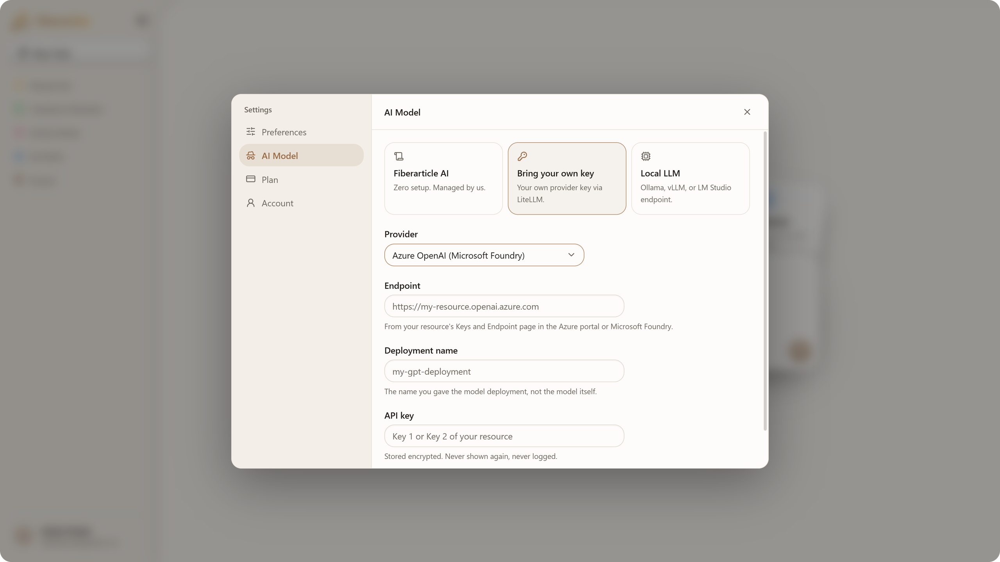

<picture>
  <source media="(prefers-color-scheme: dark)" srcset=".github/assets/readme/tagline-dark.png">
  
</picture>

[Try Fiberarticle](https://app.fiberarticle.com) &nbsp;|&nbsp; [Website](https://fiberarticle.com) &nbsp;|&nbsp; [Pricing](https://fiberarticle.com/pricing/) &nbsp;|&nbsp; [Microsoft Marketplace](https://marketplace.microsoft.com/en-us/product/saas/fiberarticle.fiberarticle?tab=Overview) &nbsp;|&nbsp; [Blogs](https://fiberarticle.com/blogs/)

  

 

Click the picture to watch the product demo.

 

## Why Fiberarticle

A good research paper starts long before the first sentence. You search many databases, open hundreds of PDFs, note down what each paper did, find where the gaps are, and only then start writing. For most students and researchers this takes weeks, and a lot of that time goes into searching, copying and keeping track.

Fiberarticle does this groundwork for you. Just describe your topic in your own words, the way you would explain it to a friend. It searches more than 200 million scholarly papers, picks the ones that truly match, reads the open-access ones in full, and gives you a research report, a literature review or a full article. Every point it makes is tied to a real paper that you can open and check.

You stay in charge. You read the output, edit it with AI help, pick your journal's template and export the final file.

## Who it is for

- **Students** doing their B.Tech, M.Tech, Masters or PhD who need a literature review or a strong first draft for a project or thesis.
- **Researchers and faculty** who want to understand a new area quickly, or keep up with what is new in their own field.
- **R&D and innovation teams** who need clear, cited answers before taking a decision.
- **Universities and institutions** that want one research tool for many people, bought through Microsoft Marketplace.

## Meet the agents

Fiberarticle has four AI agents and one extraction tool. Pick an agent, type what you need and press send.

| Agent | You give it | You get back |
| --- | --- | --- |
| **Researcher** | A topic, a question or a hypothesis | A research report with numbered citations and the full list of sources |
| **Literature Reviewer** | A topic for a review | An evidence matrix of every paper, plus trends, methods, datasets, gaps and future work |
| **Article Writer** | What your article should be about | A complete article, section by section, ready to edit and export |
| **AI Assistant** | Any research question | A short, cited answer drawn from the best papers |
| **Extract** | Papers from your runs, and what to pull out of them | A table of exactly those details, downloadable as CSV |

### Researcher

Give it a topic and it runs a deep search across arXiv, OpenAlex, Semantic Scholar and Crossref. You can watch every step live as it plans, searches, screens, reads and writes. It keeps up to 40 of the most relevant papers, and a run usually takes between 15 and 40 minutes depending on the topic. When the report is ready, one click on **Generate article** turns it into a full manuscript.

A finished run. The agent's twelve steps are on the left, and the cited report is on the right.

### Literature Reviewer

Made for the review chapter of a thesis, or for a full review paper. Every selected paper gets its own row: what it proposes, how it was done, and its limitations and research gaps. Then the agent reads the whole table together to find trends, common methods, datasets, open gaps and future work. You can search the matrix, sort it by year or by citations, and download it as CSV.

The evidence matrix. One row per paper, with its source and whether the full text was read.

### Article Writer

It researches first and then writes. Your article comes with an Abstract, Introduction, Related Work, Methodology, Results, Discussion, Conclusion and References. Open it in the editor and change anything yourself, or select any part and ask the AI to improve the writing, simplify it, make it sound more human, rewrite it for clarity, expand it, shorten it, change the tone or translate it.

The article editor, here with the Elsevier template, APA citations and the Ask AI panel.

### AI Assistant

For quick questions. Ask anything and get a short answer with citations from the strongest papers, then keep the conversation going.

## How it works

Every agent works the same careful way, so what you get comes from real papers and not from AI guesswork.

### Why you can trust the output

- **Real papers only.** Every source comes from arXiv, OpenAlex, Semantic Scholar or Crossref, with its DOI wherever one exists.
- **Full text, not just abstracts.** Open-access PDFs are found through Unpaywall and read in full. Each paper clearly shows whether its full text was read.
- **Every claim is cited.** Numbered citations like [3] point to the exact paper in the reference list.
- **It checks its own work.** If the evidence is thin, the agent writes new search queries and goes again, up to two more rounds, before it writes anything.
- **Journal quality at a glance.** Papers carry their Scimago quartile, from Q1 to Q4, so you know where each one was published.
- **Nothing is lost.** If a run stops midway, it can continue from the same step instead of starting again.
- **Tested, not assumed.** The [evaluations](evaluations) folder has the scripts we use to measure screening against human decisions and to check that citations really support the sentences they sit in.

## From draft to submission

Fiberarticle does not stop at a draft. It gets your article into the shape your journal expects.

- **6 journal templates:** Generic manuscript, IEEE, ACM, Elsevier, Springer Nature and NeurIPS.
- **58 citation styles:** APA, IEEE, Vancouver, Harvard, Chicago, MLA, Nature, The Lancet, ACM, Springer, Elsevier and many more.
- **Export the way you need:** Word (.docx and .doc), PDF, HTML, or a LaTeX project that opens and compiles on Overleaf as it is.
- **Bring your own papers:** attach your own PDFs to a task, and they are always included as sources along with the papers the agent finds.

## Use the AI model you like

Choose how Fiberarticle thinks in **Settings, AI Model**:

- **Fiberarticle AI:** zero setup, managed by us. Nothing to configure.
- **Bring your own key:** use your own OpenAI, Anthropic, Google Gemini, Azure OpenAI, DeepSeek, Groq or OpenRouter key. Keys are stored encrypted and are never shown again or logged.
- **Local LLM:** connect your own Ollama, vLLM or LM Studio endpoint and run the model on your own hardware.

You can sign in with email and password, with Google, or with a Microsoft work, school or personal account.

## Pricing

Fiberarticle is a **one-time payment, not a subscription**. Pay once and every agent and feature is unlocked for your account.

- **Individuals in India:** a one-time price of ₹19,999 plus payment gateway charges, paid securely through Razorpay with UPI, cards or net banking.
- **Universities and organisations:** buy a 5-year plan through [Microsoft Marketplace](https://marketplace.microsoft.com/en-us/product/saas/fiberarticle.fiberarticle?tab=Overview) using your existing Microsoft billing.
- **Want us to do it for you?** [Contact us](https://fiberarticle.com/contact/) and tell us what you need.

Before paying, you can sign up and look around the dashboard. See the [pricing page](https://fiberarticle.com/pricing/) for full details.

## License

The source code is open under the [Apache License 2.0](LICENSE). The hosted app at [app.fiberarticle.com](https://app.fiberarticle.com) is a paid service.

 

**Research faster. Write with evidence. Submit with confidence.**

[Start with Fiberarticle](https://app.fiberarticle.com)

